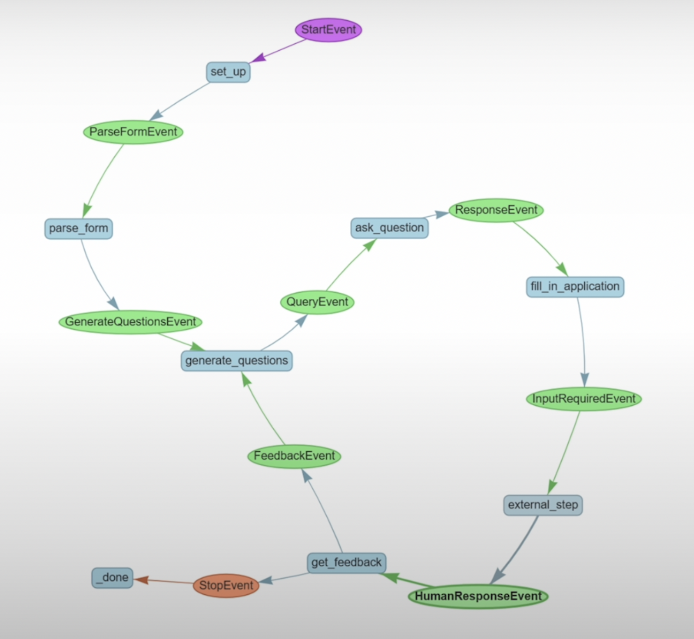
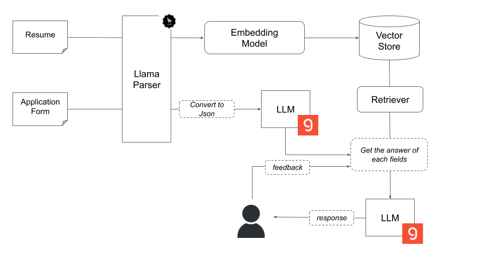
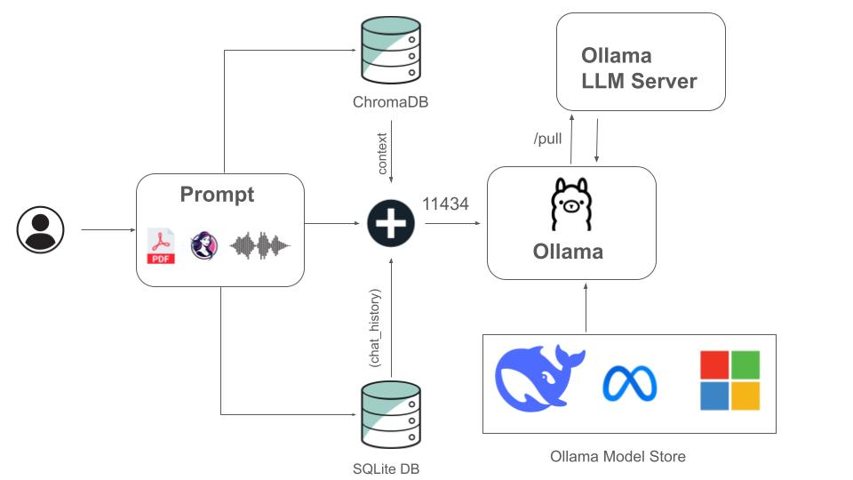
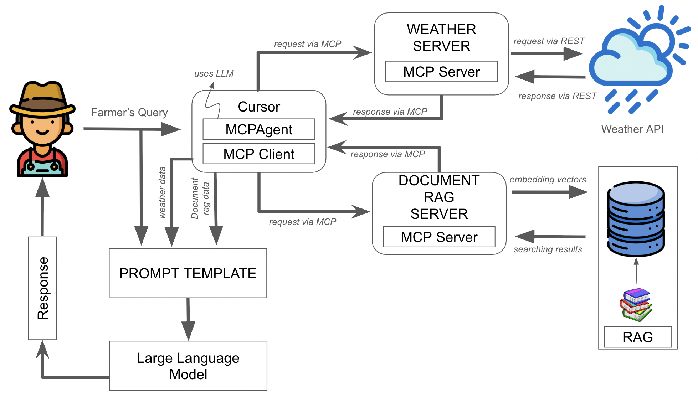
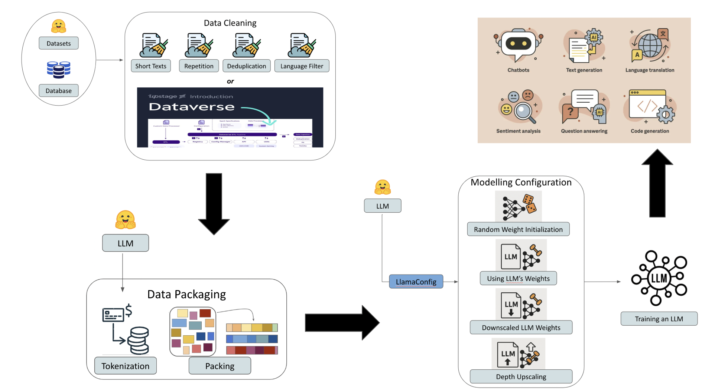
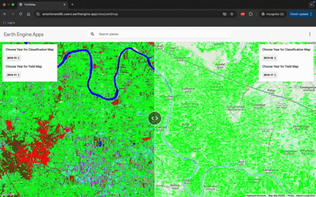
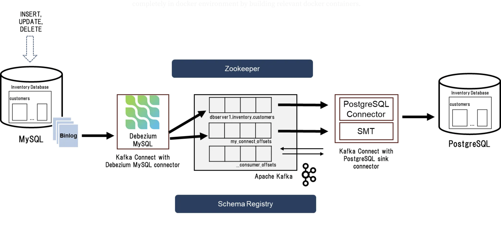
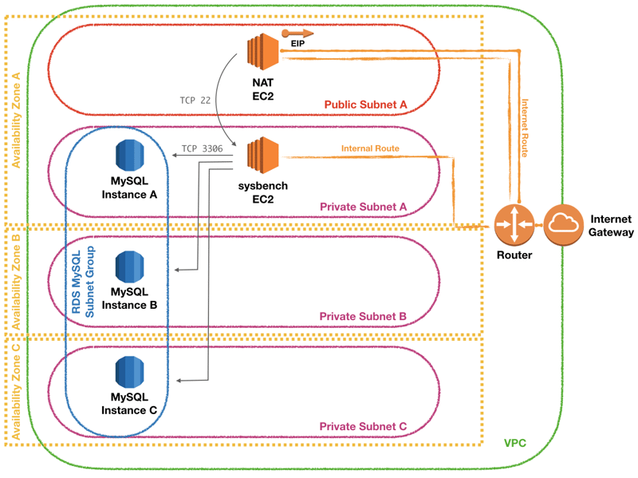

# Portfolio

---

## Generative AI

### Agentic Document Extraction for Filling the Application Form

  LlamaIndex
  Groq LLM
  Hugging Face
  Agentic Workflow
  Embeddings
  Event-driven

This project showcases an advanced intelligent form-filling agent built using LlamaIndex's workflow framework to orchestrate complex AI-driven processes within an event-driven architecture. It integrates Groq's LLM for sophisticated natural language understanding and generation, while leveraging Hugging Face embedding models for high-dimensional vector representations. The system employs vector store indexing for efficient document retrieval, enabling contextual augmentation of LLM-generated outputs for enhanced accuracy. Designed as an automation tool for extracting and populating form fields, the agent dynamically processes structured and unstructured data sources, such as user-provided documents (e.g., resumes). Furthermore, it incorporates a human-in-the-loop feedback mechanism, acknowledging the role of LLMs as augmentative rather than autonomous systems. Based on user feedback, the system iteratively refines its responses, ensuring improved accuracy and alignment with human intent.

 
{: .center-image}
 

 
{: .center-image}
 

---

### Multimodal AI System with Local LLMs for Document, Image, and Voice Processing

  ChromaDB
  Ollama
  Whisper
  SQLite
  Streamlit
  Multimodal AI

This project demonstrates a streamlined system integrating multiple large language models with ChromaDB vector storage for local document processing, audio transcription, and image analysis capabilities. Developed to ensure complete data sovereignty and privacy by running sophisticated language models entirely on-premises, eliminating cloud dependencies and external API requirements. I architected and developed a comprehensive multimodal chatbot system that operates entirely locally, demonstrating my expertise in modern LLM technologies. By implementing an extensible architecture supporting multiple language models through Ollama integration, I engineered sophisticated features including semantic document search using ChromaDB vector storage, real-time audio transcription with Whisper models, and efficient document chunking for context-aware responses. I designed a robust state management system using SQLite with thread-safe connection pooling, while creating an intuitive user interface with Streamlit. The project showcases my ability to handle complex system architecture, work with cutting-edge LLM technologies, and implement production-grade features like session management, document processing, and multimodal interactions - all while maintaining data privacy and security through local deployment

 
{: .center-image}
 

---

### FarmGPT: MCP-Driven RAG & LLM Agricultural Advisor

  RAG
  MCP
  ChromaDB
  PLLaMa

FarmGPT is a modular Decision Support System for agriculture, leveraging Generative AI to deliver personalized recommendations to farmers. The architecture is built on Model Context Protocol (MCP) servers, with dedicated servers for weather data retrieval and agricultural knowledge access via Retrieval-Augmented Generation (RAG). The backend utilizes ChromaDB as a vector database for semantic search across curated agricultural documents, and employs transformer-based embedding models for document vectorization. Custom prompt engineering ensures optimal interaction with Large Language Models (LLMs), supporting configurable integration of advanced open-source models such as PLLaMa, Llama 2, and Mistral. The system features a robust command-line interface, enabling farmers to input crop details, soil parameters, and queries to receive actionable, context-aware guidance. Technical highlights include asynchronous Server-Sent Events (SSE) for real-time data streaming, and a modern API-first design—demonstrating expertise in LLM orchestration, vector search, and practical AI for real-world agricultural decision-making.

 
{: .center-image}
 

---

### Building your own LLM from Scratch

  Hugging Face
  Open Pretrained Transformer
  Transfer Learning
  DataVerse

This project demonstrates a comprehensive approach to building and training Large Language Models (LLMs) from the ground up using the Hugging Face transformers library. The implementation leveraes Meta's OPT (Open Pretrained Transformer) architecture as base pretrained model and showcases the complete pipeline from data preparation to model training. The project begins with robust data preparation using two alternative approaches: Upstage's DataVerse ETL framework and traditional custom cleaning methods, processing data from Hugging Face's pretraining dataset and scraped Python scripts from GitHub.The data preparation phase includes thorough cleaning steps to ensure quality training data, followed by efficient data packaging. The model configuration step demonstrates four distinct initialization strategies: random initialization, transfer learning from existing models, innovative architecture modifications through downscaling (12→10 layers), and upscaling (12→16 layers), all built upon the facebook/opt-125m model as the base architecture. The training implementation leverages Hugging Face's Trainer with advanced features like gradient checkpointing and mixed-precision training (bfloat16), showcasing practical approaches to LLM pre-training while balancing computational efficiency and model performance. This project serves as a comprehensive guide for understanding and implementing the full lifecycle of building an LLM from scratch.

 
{: .center-image}
 

---

## Data Science & Engineering

### Decision Support System (DSS) for Agriculture Monitoring using Convolutional Neural Network (CNN)

  CNN
  Google Earth Engine
  Remote Sensing
  Satellite Image Processing
  Computer Vision
  LANDSAT

For my Master’s Thesis at the Centre for Technology Alternatives for Rural Areas, IIT Bombay, an interdisciplinary department focused on improving agricultural productivity in India, I developed a web portal for farmers, government agencies, and sugarcane mills to enable real-time crop monitoring using remote sensing in Google Earth Engine (GEE). Using CNN models on open-source satellite imagery, Sentinel and LANDSAT, the system achieved 78% accuracy and an F1-score of 0.8 in crop yield prediction. The portal contributed to a 15% increase in the Minimum Selling Price (MSP) of sugarcane by enhancing supply chain efficiency and reducing spoilage.

 
{: .center-image}
 

---

### Near Real Time Data Replication from MySQL to PostgreSQL

  CDC
  Debezium
  Kafka
  Docker
  MySQL
  PostgreSQL
  Data Streaming

For my project on Near Real-Time Data Replication from MySQL to PostgreSQL, I built a change data capture (CDC) pipeline using Debezium, Kafka, and Docker for seamless, low-latency data replication. I analyzed change data events (INSERT, UPDATE, DELETE) from MySQL, streamed them to Kafka, and replicated them to PostgreSQL in a fully containerized setup. This project showcases my expertise in data streaming, infrastructure automation, and scalable data pipelines. It has real-world applications in real-time analytics, cross-database synchronization, and cloud migrations, enabling fault-tolerant, downtime-free data integration across diverse environments.

 
{: .center-image}
 

---

### Performance Testing of RDS MySQL Database using sysbench

  Amazon RDS
  MySQL
  sysbench
  EC2
  CloudWatch
  AWS

For my project on Performance Testing of Amazon RDS MySQL, I implemented a benchmarking framework using sysbench to evaluate database performance under different workloads. I deployed an Amazon EC2 instance to generate synthetic queries against an RDS MySQL database while monitoring key metrics like query latency, CPU utilization, and IOPS using Amazon CloudWatch. This project demonstrates my expertise in database performance optimization, cloud infrastructure, and benchmarking techniques. It has real-world applications in database capacity planning, optimizing cloud costs, and ensuring high-performance database configurations for scalable applications.

 
{: .center-image}
 

---
{: style="text-align: center"}
© 2025 Aman Lonare. Powered by Jekyll and the Minimal Theme.
